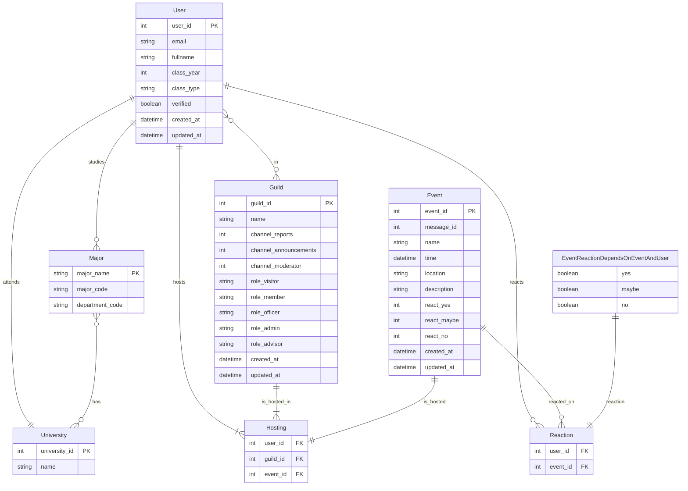

# CAPY DB

```mermaid
erDiagram
    User {
        int user_id PK
        string email
        string fullname
        int class_year
        string class_type
        boolean verified
        datetime created_at
        datetime updated_at
    }

    University {
        int university_id PK
        string name
    }

    Major {
        string major_name PK
        string major_code
        string department_code
    }

    Guild {
        int guild_id PK
        string name
        int channel_reports
        int channel_announcements
        int channel_moderator
        string role_visitor
        string role_member
        string role_officer
        string role_admin
        string role_advisor
        datetime created_at
        datetime updated_at
    }

    Event {
        int event_id PK
        int message_id
        string name
        datetime time
        string location
        string description
        int react_yes
        int react_maybe
        int react_no
        datetime created_at
        datetime updated_at
    }

    User ||--|| University : "attends"
    User ||--o{ Major : "studies"
    Major }o--o{ University : "has"
    User }o--o{ Guild : "in"

    Hosting {
        int user_id FK
        int guild_id FK
        int event_id FK
    }

    User ||--|{ Hosting : "hosts"
    Guild ||--|{ Hosting : "is_hosted_in"
    Event ||--|| Hosting : "is_hosted"

    EventReactionDependsOnEventAndUser {
        boolean yes
        boolean maybe
        boolean no
    }

    Reaction {
        int user_id FK
        int event_id FK
    }

    User ||--o{ Reaction : "reacts"
    Event ||--o{ Reaction : "reacted_on"
   EventReactionDependsOnEventAndUser ||--|| Reaction : "reaction" 

```
