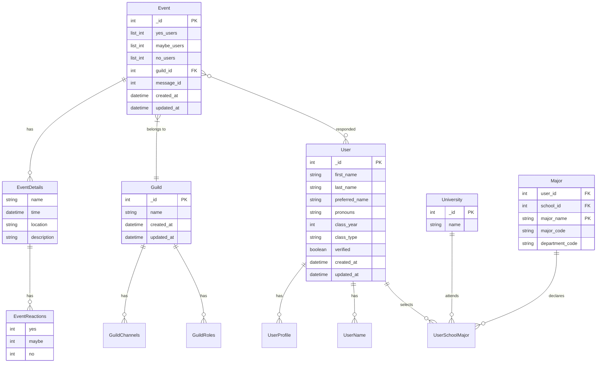

```mermaid
erDiagram
    User {
        int _id PK
        string first_name
        string last_name
        string preferred_name
        string pronouns
        int class_year
        string class_type
        boolean verified
        datetime created_at
        datetime updated_at
    }

    University {
        int _id PK
        string name
    }

    Major {
        int user_id FK
        int school_id FK
        string major_name PK
        string major_code
        string department_code

    }

    Guild {
        int _id PK
        string name
        datetime created_at
        datetime updated_at
    }

    Event {
        int _id PK
        list_int yes_users
        list_int maybe_users
        list_int no_users
        int guild_id FK
        int message_id
        datetime created_at
        datetime updated_at
    }

    EventDetails {
        string name
        datetime time
        string location
        string description
    }

    EventReactions {
        int yes
        int maybe
        int no
    }

    User ||--o{ UserProfile : "has"
    User ||--o{ UserName : "has"
    Guild ||--o{ GuildChannels : "has"
    Guild ||--o{ GuildRoles : "has"
    Event ||--o{ EventDetails : "has"
    EventDetails ||--o{ EventReactions : "has"

    Event }|--|| Guild : "belongs to"
    Event }o--o{ User : "responded"

    User ||--o{ UserSchoolMajor : "selects"
    University ||--o{ UserSchoolMajor : "attends"
    Major ||--o{ UserSchoolMajor : "declares"
```
